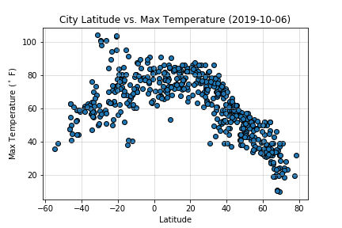
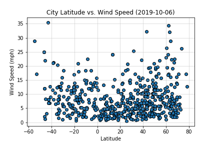
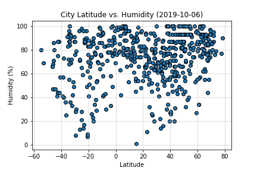

# Weather-Pie: Analysis of Weather at differing Latitudes

How does weather change as we get closer to the equator? The question posed to us in this activity is simple: how can we prove that it is hotter at the equator? What about other weather properties?

## Openweathermaps API

Quering the openweathermaps API, and a randomly generated list of cities based (using citypy), we created a list of 500+ cities round the world and generated their weather data. That data has been cleaned and combined into `cities_weather.csv`.
Using the data in `cities_weather.csv`, we begin to answer the question, how does the weather change closer to the equator? Using the latitiude of the cities we sampled, we generated four graphs charting the temperature, wind speed, humidity, and cloudiness based on the latitude of the sampled cities.

### Temperature

From our graph above, we can see immediately that yes, it is hotter at the equator. Generally, we can see the trend follows this beautiful parabolic/sine curve with a peak around the equator. This makes immediate sense, considering solar flux, and generally temperature, is dependent on the angle that we make with the sun. There are numerous ways we can expand this graph, e.g. through time, where we can see subtle shifts in the temperature. Overall, this graph does tell us that it is HOTTER at the equator. 

### Wind Speed

Initially, our gut senses told us that it is hotter at the equator. However, with that temperature difference comes wind. Equalizing high and low pressures creates wind. High pressure is generally correlated to colder air, and low pressure is correlated with hotter air. Above we can see that closer to the poles, stronger winds are generated. Interestingly, we can make sense of this if we think about temperature gradients. The equator, as seen above, experiences a smaller temperature gradient compared to higher (absolute) latitudes. Wind speed would be stronger where there are greater temperature gradients. We can kind of see that the temperature and wind speed graphs are almost inverses of each other.

### Humidity

This graph of Humidity and Latitude makes no sense. We would expect colder air to hold less water than hotter air, thus leading to another curve similar to temperature. Instead, air tends to be staturated to between 60\% and 80\%. Further, we can see that southern latitudes have a lower spread in humidity compared to the equator. This does make sense when we consider the southern hemipshere to have a much greater ocean surface area than the northern hemisphere.

## Conclusion

Weather is an interesting and complex phenomena. Though it follows strict laws, the combination of so many variables creates the chaotic system every person experiences daily. Based on our analysis, we can definitely conclude at least one thing: it is hot at the equator. 